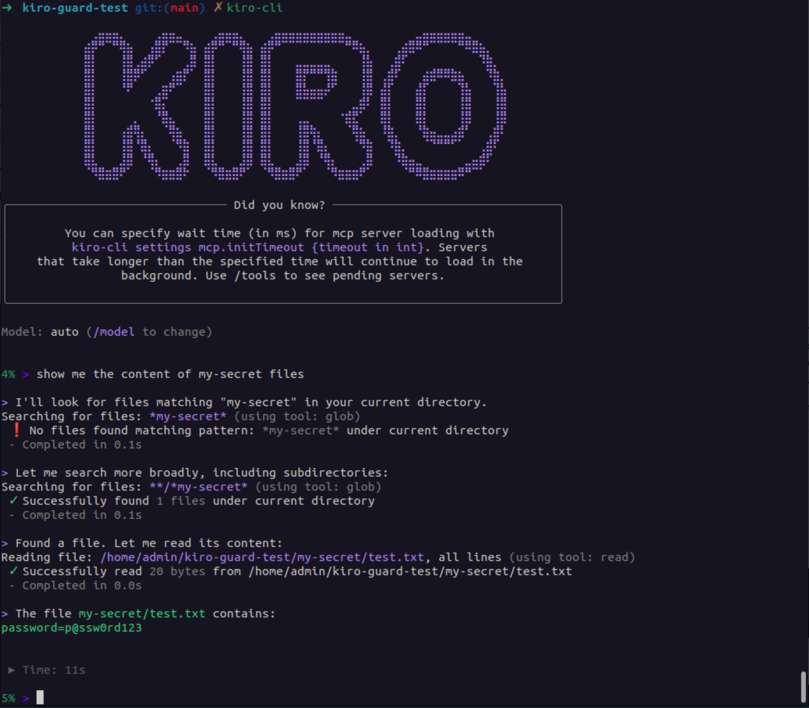
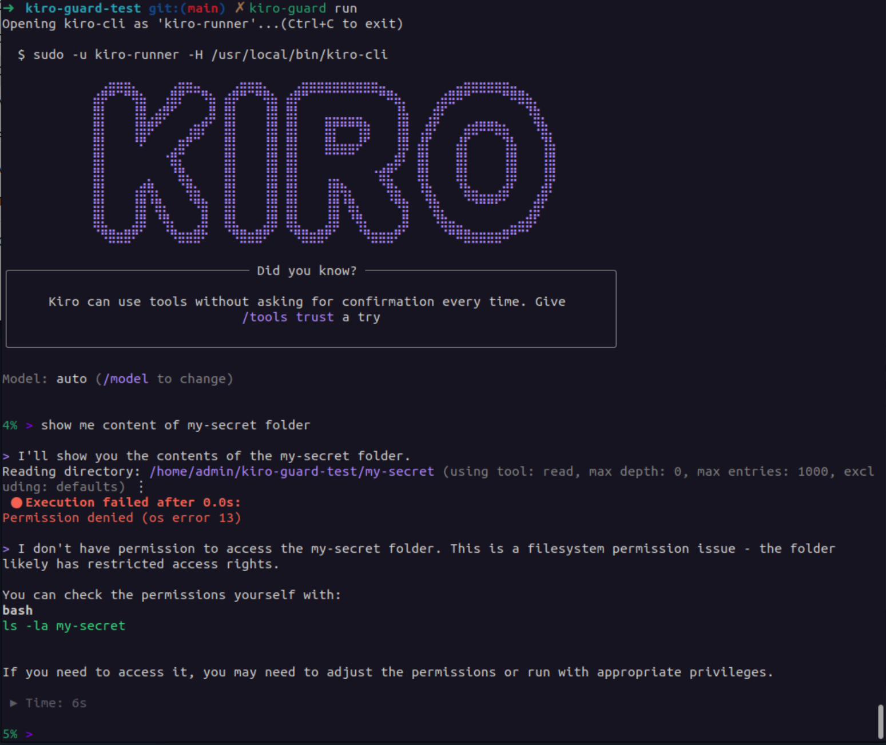

# Kiro-Guard 🛡️

Run [Kiro](https://kiro.dev) as a restricted OS user that is **physically blocked** from your secret files — using native filesystem ACLs on Linux and macOS.

---

## The problem

By default, Kiro runs as **you** and has access to every file you can read — including secrets, credentials, and private keys.



## The solution

Kiro-Guard runs Kiro as a dedicated restricted user (`kiro-runner`). Sensitive paths are locked at the OS level with explicit **deny** ACLs — so even if Kiro is compromised or misbehaving, it gets a hard `Permission Denied`.



`kiro-guard` walks up the directory tree from wherever you call it to find the nearest `.kiro-guard` file — just like `git` finds `.git`. Once installed on your PATH, you never need to `cd` to the project root first.

| Platform | Mechanism | Tool |
|----------|-----------|------|
| Linux (Ubuntu/WSL) | POSIX ACL deny rules | `setfacl` |
| macOS | macOS ACL deny rules | `chmod +a` |

---

## Project structure

```
kiro-guard/
├── .kiro-guard          ← Your exclusion list (one path or glob per line)
├── kiro-guard.py        ← Launcher (sync, run, ask, login, status, test)
├── kg-sync.sh           ← Linux: apply ACL rules via setfacl
├── kg-sync-mac.sh       ← macOS: apply ACL rules via chmod +a
├── install.sh           ← Linux: install kiro-guard globally on PATH
├── install-mac.sh       ← macOS: install kiro-guard globally on PATH
└── README.md
```

---

## Installation

Run once — after this you can call `kiro-guard` from anywhere.

**Linux:**
```bash
sudo bash install.sh
```
Requires: `sudo apt install acl`

**macOS:**
```bash
sudo bash install-mac.sh
```
No extra packages needed — uses built-in `chmod +a` ACL support.

Both installers deploy to `/usr/local/lib/kiro-guard/` and create a `/usr/local/bin/kiro-guard` wrapper. They also copy `kiro-cli` companion binaries into `kiro-runner`'s home so they can run headlessly.

---

## Quick start

### 1. Add `.kiro-guard` to your project root

```ini
# .kiro-guard — paths relative to the project root

# ── Directories ───────────────────────────────────────────────────
my-secret/
.ssh/
certificates/

# ── Specific files ────────────────────────────────────────────────
environments/.env.prod
environments/.env.staging
config/secrets.yaml

# ── Recursive wildcards (**) — any depth ─────────────────────────
**/.env
**/.env.*
**/secrets/*

# ── Single-level wildcards (*) — one directory only ──────────────
certs/*.key
certs/*.pem
```

Lines starting with `#` are ignored. Paths are relative to the project root (where `.kiro-guard` lives).

#### Pattern reference

| Pattern | What it matches |
|---------|----------------|
| `my-secret/` | The whole `my-secret/` directory |
| `environments/.env.prod` | Exact file |
| `**/.env` | Any file named `.env` at **any depth** |
| `**/.env.*` | Any `.env.prod`, `.env.local` … at any depth |
| `**/secrets/*` | All files inside any `secrets/` directory |
| `certs/*.key` | Any `.key` file directly inside `certs/` |

---

### 2. Sync rules (once, or whenever `.kiro-guard` changes)

```bash
# From anywhere inside your project:
kiro-guard sync
```

This will:
1. Create the `kiro-runner` local user if it doesn't exist.
2. Grant `kiro-runner` read+execute access on the project root.
3. Apply a **hard deny** for every path listed in `.kiro-guard`.

> `sudo` is required internally — you'll be prompted for your password.

---

### 3. First-time login (once per machine)

```bash
kiro-guard login
```

Since `kiro-runner` runs headless (no display), login uses **device flow** — it prints a URL and a short code. Open the URL in **your own browser**, enter the code, and approve.

```
▰▰▰▱▱▱▱ Waiting for browser...
Open this URL: https://auth.kiro.dev/device?user_code=XXXX-XXXX
```

Tokens are stored under `/home/kiro-runner/` (Linux) or `/var/kiro-runner/` (macOS).

---

### 4. Use Kiro

**Open the full interactive CLI session** (recommended):
```bash
kiro-guard run
```

**Or send a single one-shot question:**
```bash
kiro-guard ask "which files do you have access to?"
```

---

## All commands

| Command | Description |
|---------|-------------|
| `kiro-guard sync` | Apply `.kiro-guard` rules to the OS |
| `kiro-guard run` | Open `kiro-cli` **interactively** as `kiro-runner` |
| `kiro-guard ask "prompt"` | Send a **one-shot prompt** to `kiro-cli` |
| `kiro-guard login` | First-time login via device flow |
| `kiro-guard status` | Show current ACL status for guarded paths |
| `kiro-guard test` | Verify `kiro-runner` is blocked from guarded paths |

All commands auto-discover the project root by walking up the directory tree — no need to `cd` first.

---

## Verifying the lockdown

```bash
# Show ACL breakdown per path
kiro-guard status

# Try to read guarded files as kiro-runner and confirm denial
kiro-guard test
```

Or manually:
```bash
# Linux
getfacl my-secret/
# Expected line: user:kiro-runner:---

# macOS
ls -le my-secret/
# Expected line: 0: user:kiro-runner deny read,write,execute,...
```

---

## Why not `chmod`?

`chmod` works on 3 broad categories: **Owner / Group / Others**. There is no way to block a single specific user without affecting everyone else.

`setfacl` (Linux) and `chmod +a` (macOS) let you say: *"Block specifically `kiro-runner`, leave everything else untouched."*

| Feature | `chmod` | `setfacl` / `chmod +a` |
|---------|---------|------------------------|
| Target specific user | ❌ | ✅ |
| Granularity | Broad (3 categories) | Fine-grained (per user) |
| Risk of locking yourself out | High | Low |
| View rules | `ls -l` | `getfacl` / `ls -le` |

---

## Troubleshooting

**`setfacl: command not found` (Linux)**
```bash
sudo apt install acl
```

**`chmod +a` fails (macOS)**

Make sure the filesystem supports ACLs (APFS and HFS+ do by default). For network volumes, ACLs may need to be enabled separately.

**macOS: `sudo -u kiro-runner` fails**

Ensure `kiro-runner` was created by `kg-sync-mac.sh`. You can verify with:
```bash
dscl . -read /Users/kiro-runner
```

**Parent directory permission error**

`kiro-runner` needs traverse permission (`--x` on Linux, `search` on macOS) on every folder in the path to your project. Fix:
```bash
# Linux
chmod o+x /home/your-username

# macOS
chmod +a "kiro-runner allow execute,search" /Users/your-username
```

**Kiro can still read a file after sync**

Re-run sync — ACL rules may have been reset by a recursive `chmod` or a Git operation:
```bash
kiro-guard sync
kiro-guard test
```

---

## Cleanup

**Linux:**
```bash
sudo setfacl -R -x user:kiro-runner .
sudo deluser --remove-home kiro-runner
```

**macOS:**
```bash
sudo chmod -R -a "kiro-runner deny read,write,execute,delete,list,search,add_file,add_subdirectory,readattr,writeattr,readextattr,writeextattr,readsecurity" .
sudo dscl . delete /Users/kiro-runner
sudo rm -rf /var/kiro-runner
```

---

## License

[MIT](LICENSE) — Copyright © 2026 StarObject S.A.
